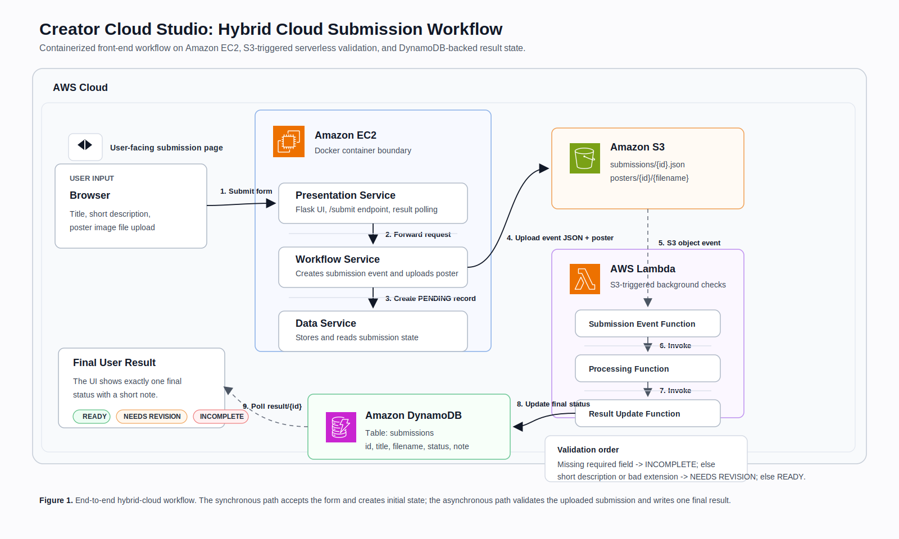

# Creator Cloud Studio

Creator Cloud Studio is a small hybrid cloud application for handling event poster submissions. A user submits an event title, a short description, and a real poster image file through a web interface. The system stores the submission, runs an automatic background validation workflow, and returns one final result: `READY`, `NEEDS REVISION`, or `INCOMPLETE`.

This project was built for a cloud computing mini-project focused on service decomposition, event-driven workflow design, and integration between containers and serverless functions.



## Features

- Web-based poster submission form
- Real poster file upload, not filename-only input
- Containerized front-end workflow on Amazon EC2
- Event and file storage in Amazon S3
- Serverless background validation with AWS Lambda
- Submission state storage in Amazon DynamoDB
- Three final result states required by the project:
  - `INCOMPLETE`
  - `NEEDS REVISION`
  - `READY`

## Validation Rules

The project follows the required rule order exactly:

1. If any required field is missing, the final status is `INCOMPLETE`.
2. Only if all required fields are present, the system checks the remaining rules.
3. If the description is shorter than 30 characters, or the poster filename extension is not `.jpg`, `.jpeg`, or `.png`, the final status is `NEEDS REVISION`.
4. Otherwise, the final status is `READY`.

The UI shows one final result together with a short explanatory note.

## Architecture Overview

The system uses both containers and serverless functions.

### Containerized services on EC2

- `presentation-service`
  - Serves the front end
  - Accepts form submissions
  - Polls for final results

- `workflow-service`
  - Receives submission requests from the presentation layer
  - Uploads the submission event JSON to S3
  - Uploads the real poster image file to S3
  - Creates the initial submission state

- `data-service`
  - Stores and reads submission state in DynamoDB
  - Provides status data to the front end

### Serverless workflow

- `submission-event-function`
  - Triggered by the S3 submission JSON upload
  - Starts the background workflow

- `processing-function`
  - Applies the required validation rules
  - Produces the final status and note

- `result-update-function`
  - Writes the final result back to DynamoDB

### AWS services used

- Amazon EC2
- Docker
- Amazon S3
- AWS Lambda
- Amazon DynamoDB

## Workflow

1. The user submits a title, description, and poster image file from the browser.
2. The `presentation-service` forwards the request to the `workflow-service`.
3. The `workflow-service` uploads:
   - a submission event JSON to `submissions/`
   - the uploaded poster image to `posters/`
4. The `workflow-service` creates an initial submission record.
5. The S3 event triggers the Lambda workflow.
6. The Lambda functions validate the submission.
7. The final status and note are written to DynamoDB.
8. The front end polls the result endpoint and shows the final result.

## Project Structure

```text
.
├── README.md
└── creator-cloud-studio
    ├── data-service
    │   ├── app.py
    │   ├── Dockerfile
    │   └── requirements.txt
    ├── docs
    │   ├── creator-cloud-studio-architecture.svg
    │   ├── creator-cloud-studio-architecture-embedded.svg
    │   ├── creator-cloud-studio-paper-figure.svg
    │   └── creator-cloud-studio-paper-figure-embedded.svg
    ├── lambda
    │   ├── processing-function
    │   ├── result-update-function
    │   └── submission-event-function
    ├── presentation-service
    │   ├── app.py
    │   ├── Dockerfile
    │   ├── requirements.txt
    │   └── templates
    ├── workflow-service
    │   ├── app.py
    │   ├── Dockerfile
    │   └── requirements.txt
    ├── deploy-ec2.sh
    └── test-cases.sh
```

## Running the Project

This project is designed for AWS deployment, with the three Flask services running as Docker containers on an EC2 instance.

### Front-end endpoint

When deployed on EC2, the web UI is served through:

```text
http://<EC2-PUBLIC-IP>:5000/
```

### Service ports

- `presentation-service`: `5000`
- `data-service`: `5001`
- `workflow-service`: `5002`

### EC2 deployment

The repository includes an EC2 deployment helper script:

```bash
creator-cloud-studio/deploy-ec2.sh
```

This script:

- installs Docker
- logs into Amazon ECR
- pulls the latest service images
- starts the three containers
- exposes the required ports

## Example Result Cases

### INCOMPLETE

- Missing title
- Missing description
- Missing uploaded poster file

### NEEDS REVISION

- Description shorter than 30 characters
- Invalid poster filename extension

### READY

- All required fields are present
- Description length is at least 30 characters
- Poster filename uses `.jpg`, `.jpeg`, or `.png`

## Demo And Documentation

Architecture diagrams are included in:

- [creator-cloud-studio/docs/creator-cloud-studio-architecture.svg](creator-cloud-studio/docs/creator-cloud-studio-architecture.svg)
- [creator-cloud-studio/docs/creator-cloud-studio-architecture-embedded.svg](creator-cloud-studio/docs/creator-cloud-studio-architecture-embedded.svg)
- [creator-cloud-studio/docs/creator-cloud-studio-paper-figure.svg](creator-cloud-studio/docs/creator-cloud-studio-paper-figure.svg)
- [creator-cloud-studio/docs/creator-cloud-studio-paper-figure-embedded.svg](creator-cloud-studio/docs/creator-cloud-studio-paper-figure-embedded.svg)

The paper-style figure is intended for reports, slides, and video walkthroughs.

## Notes

- This project keeps the front end intentionally lightweight to match the assignment scope.
- The core focus is the hybrid cloud workflow rather than a large-scale UI system.
- Uploaded poster files are stored in S3, while final submission state is stored in DynamoDB.

## License

This repository is provided for academic project use.
